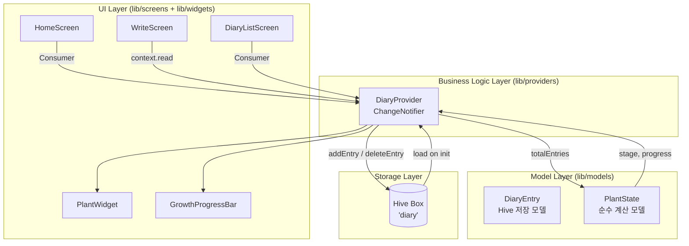
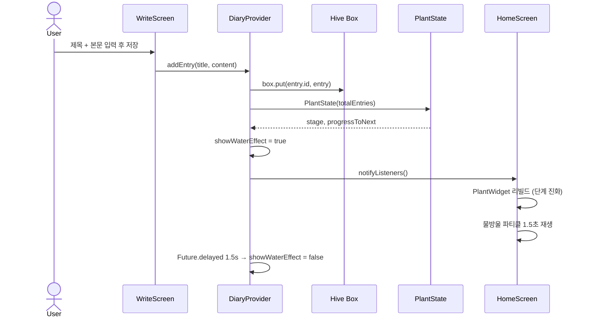

# 03 — 아키텍처 계획 (Architecture Plan)

> 상세 구현 결과는 `docs/architecture.md`를 참고하세요.
> 이 파일은 **설계 의도와 결정 과정**을 기록합니다.

## 시스템 레이어 다이어그램

## 데이터 흐름 다이어그램

## 핵심 설계 원칙

1. **단방향 데이터 흐름**: UI → Provider → 저장소 → Provider → UI
2. **PlantState 불변성**: 저장소 없는 순수 계산 모델. 입력은 `totalEntries` 하나.
3. **단일 Provider**: 앱 규모상 분리보다 응집이 유리
4. **빌드러너 제거**: `diary_entry.g.dart`를 수동 작성해 빌드 단계 단순화

## 대안 검토

| 영역 | 대안 | 선택 | 이유 |
|------|------|------|------|
| 상태 관리 | Riverpod | Provider | 이 규모에 과도함 |
| 상태 관리 | Bloc | Provider | 보일러플레이트 많음 |
| 저장소 | SQLite | Hive | 구조화 쿼리 불필요, 설정 복잡 |
| 저장소 | SharedPreferences | Hive | 리스트 저장에 부적합 |

선택 근거는 `.planning/decisions/ADR-*.md` 참고.

## 확장 포인트 (향후 고려)

- **사진 첨부 (C-01)**: `DiaryEntry`에 `imagePath?: String` 필드 추가
- **클라우드 동기화**: `DiaryProvider`에 `RemoteRepository` 인터페이스 추가
- **식물 종류 다양화**: `PlantState`에 `plantType` enum 추가
