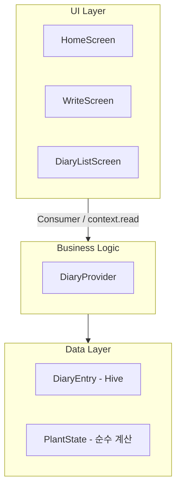

# 아키텍처 (Architecture)

## 전체 구조

```
lib/
├── main.dart                   # 앱 진입점, Hive 초기화, Provider 주입
├── models/
│   ├── diary_entry.dart        # 일기 데이터 모델 (Hive 저장)
│   ├── diary_entry.g.dart      # Hive TypeAdapter (수동 작성)
│   └── plant_state.dart        # 식물 단계 계산 순수 모델
├── providers/
│   └── diary_provider.dart     # 비즈니스 로직 + 상태 관리 (단일 진실 공급원)
├── screens/
│   ├── home_screen.dart        # 메인 화면 (화분 + 성장도)
│   ├── write_screen.dart       # 일기 작성 화면
│   └── diary_list_screen.dart  # 기록 목록 화면
└── widgets/
    ├── plant_widget.dart        # 화분 + 식물 + 물방울 파티클
    └── growth_progress_bar.dart # 성장도 프로그레스 바
```

## 레이어 구조



## 데이터 흐름

```
사용자 일기 작성
      ↓
WriteScreen → DiaryProvider.addEntry()
      ↓
Hive Box<DiaryEntry> 저장 (로컬 영구 저장)
      ↓
PlantState 재계산 (totalEntries 기반)
      ↓
ChangeNotifier → Consumer<DiaryProvider> 리빌드
      ↓
PlantWidget (단계 진화) + WaterEffect (파티클 1.5초)
```

## 상태 관리: Provider 패턴

`DiaryProvider`가 단일 진실 공급원(Single Source of Truth)입니다.

| 속성 | 타입 | 역할 |
|------|------|------|
| `plantState` | `PlantState` | 현재 식물 단계와 성장도 |
| `entries` | `List<DiaryEntry>` | 날짜 역순 일기 목록 |
| `showWaterEffect` | `bool` | 물방울 파티클 표시 플래그 |

## 저장소: Hive

- Box 이름: `'diary'` (변경 금지)
- 키: `entry.id` (UUID v4)
- `DiaryEntryAdapter`는 `diary_entry.g.dart`에 수동 작성 (빌드러너 불필요)

## 식물 진화 기준

| 단계 | 조건 (총 일기 수) | 이모지 |
|------|------------------|--------|
| 씨앗 | 0개 | 🌰 |
| 새싹 | 1~4개 | 🌱 |
| 어린나무 | 5~9개 | 🌿 |
| 나무 | 10~19개 | 🌳 |
| 숲 | 20개 이상 | 🌲 |

진화 기준은 `PlantState.stage` getter(`lib/models/plant_state.dart`)에서 관리됩니다.
