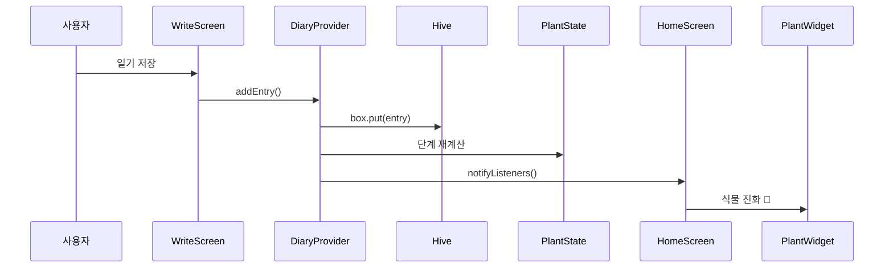

# 🌲 나의 숲 (My Forest)
## 최종 발표

**일기를 쓸 때마다 식물이 자라는 감성 다이어리 앱**

Rus12233 | Flutter | 15주차

---

## 문제

> "일기 앱은 많은데, 왜 꾸준히 못 쓸까?"

### 기존 앱의 문제
- 기록해도 **아무것도 변하지 않는다**
- 성취감 없음 → 중단
- 텍스트만 쌓이는 단조로운 경험

### 우리의 질문
**기록할 때마다 눈에 보이는 변화가 생긴다면?**

---

## 솔루션

```
일기 1편 = 화분에 물 한 번
```

| 기록 수 | 식물 | 변화 |
|--------|------|------|
| 0 | 🌰 씨앗 | 시작 |
| 1~4 | 🌱 새싹 | 첫 변화 |
| 5~9 | 🌿 어린나무 | 성장 |
| 10~19 | 🌳 나무 | 도약 |
| 20+ | 🌲 숲 | 완성 |

**저장 순간 물방울 파티클 💧 재생 → 즉각적 보상**

---

## 아키텍처



**단방향 데이터 흐름** | **단일 진실 공급원(DiaryProvider)**

---

## 핵심 구현: PlantState

```dart
// lib/models/plant_state.dart
// 순수 계산 모델 — 저장소 접근 없음
class PlantState {
  final int totalEntries;
  const PlantState(this.totalEntries);

  PlantStage get stage {
    if (totalEntries >= 20) return PlantStage.forest;
    if (totalEntries >= 10) return PlantStage.tree;
    if (totalEntries >= 5)  return PlantStage.sapling;
    if (totalEntries >= 1)  return PlantStage.sprout;
    return PlantStage.seed;
  }
}
```

**테스트 가능한 순수 함수** → 경계값 테스트 용이

---

## 기술적 도전과 해결

### 도전 1: 빌드러너 없는 Hive TypeAdapter
- **문제**: `build_runner`로 코드 생성 시 Web 빌드 복잡
- **해결**: `TypeAdapter<DiaryEntry>` 수동 구현
- **결과**: 빌드 단계 단순화, `flutter build web` 정상 동작

### 도전 2: 파티클 타이밍 동기화
- **문제**: 저장 후 파티클 표시 → 1.5초 후 자동 종료
- **해결**: `DiaryProvider`에 `Future.delayed` + `notifyListeners()` 조합
- **결과**: 저장 → 파티클 → 식물 성장이 자연스럽게 연결

---

## 데모

> 지금 바로 시연합니다

### 시연 순서
1. **앱 실행** → 🌰 씨앗 화면 확인
2. **일기 작성** → 저장 → 💧 물방울 파티클
3. **단계 확인** → 🌱 새싹으로 변화
4. **반복 입력** → 🌿 → 🌳 단계 확인
5. **기록 목록** → 날짜순 조회

```bash
flutter run -d chrome  # 기기 없이 바로 시연
```

---

## 테스트

```bash
flutter test  # 전체 통과
```

### 핵심: PlantState 경계값 테스트

```dart
test('일기 4개 → 새싹, 5개 → 어린나무', () {
  expect(PlantState(4).stage, PlantStage.sprout);
  expect(PlantState(5).stage, PlantStage.sapling);
});
```

**8개 경계값** (0, 1, 4, 5, 9, 10, 19, 20) 전체 검증

---

## 회고

### 잘 된 것
- 단방향 데이터 흐름 → 버그 추적 쉬움
- PlantState 순수 모델 → 테스트 작성이 간단
- Hive 수동 TypeAdapter → 빌드 단순화

### 아쉬운 점
- 테스트 커버리지를 더 높이지 못함
- 사진 첨부(Could Have) 미구현

### 배운 것
- AI 에이전트와 문서 주도 개발 (AGENTS.md → SPECS.md → 코드 순서)
- Flutter Provider 패턴의 실전 적용

---

## 향후 계획

| 기능 | 우선순위 | 예상 공수 |
|------|----------|----------|
| 📸 사진 첨부 (`image_picker`) | Could | 1주 |
| 📅 캘린더 뷰 | Could | 2주 |
| ☁️ 클라우드 동기화 | Won't (현재) | - |

---

# 감사합니다 🌲

> "꾸준히 기록하면 숲이 됩니다"

**GitHub**: github.com/Rus12233/app
**실행**: `flutter run -d chrome`

---
<!-- 백업 슬라이드 (Q&A 대비) -->

## 백업 1: 환경 설정

```bash
# 1. 패키지 설치
flutter pub get

# 2. 실행
flutter run -d chrome    # 웹 (기기 불필요)
flutter run              # 연결된 Android/iOS

# 오류 시
flutter clean && flutter pub get
```

자세한 내용: `docs/setup.md`

---

## 백업 2: 왜 Flutter?

> ADR-001 참고

| 항목 | Flutter | React Native |
|------|---------|-------------|
| 렌더링 | Skia/Impeller (60fps) | 네이티브 UI 위임 |
| 코드베이스 | iOS/Android/Web 하나 | 플랫폼별 일부 분리 |
| 애니메이션 | 커스텀 자유도 높음 | 제약 있음 |
| 감성 UI | ✅ 유리 | △ 보통 |

**결론**: 파티클 애니메이션 + 감성 UI + 단일 코드베이스 → Flutter

---

## 백업 3: 왜 Hive?

> ADR-002 참고

| 항목 | Hive | SQLite | SharedPreferences |
|------|------|--------|------------------|
| 속도 | 빠름 | 보통 | 보통 |
| 구조화 쿼리 | 불필요 | 필요 | 불필요 |
| 빌드러너 | 불필요 (수동) | 불필요 | 불필요 |
| 리스트 저장 | ✅ | ✅ | ❌ |

**결론**: 리스트 저장 + 빌드러너 불필요 + 빠른 속도 → Hive

---

## 백업 4: 왜 Provider?

> ADR-003 참고

| 항목 | Provider | Riverpod | Bloc |
|------|---------|----------|------|
| 학습 곡선 | 낮음 | 중간 | 높음 |
| 보일러플레이트 | 적음 | 적음 | 많음 |
| 이 규모에 적합 | ✅ | 과도함 | 과도함 |

**결론**: 입문 단계 + 소규모 앱 → Provider

---

## 백업 5: 빌드 & 배포

```bash
# Android APK (발표용 사전 빌드 권장)
flutter build apk --release
# → build/app/outputs/flutter-apk/app-release.apk

# Web (GitHub Pages)
flutter build web --release --base-href "/app/"
git subtree push --prefix build/web origin gh-pages

# iOS
flutter build ios --release
# → Xcode에서 Archive
```

자세한 내용: `docs/deploy.md`
